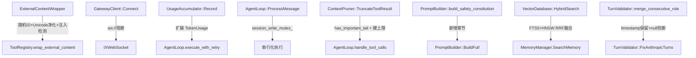

## 用户需求

基于上一轮对 RavBot 与 OpenClaw 的功能对齐审核报告，对 RavBot 的 C++ 代码实施具体修改，使其在安全性、行为正确性和功能完整性上与 OpenClaw TypeScript 参考实现对齐。

## 产品概述

RavBot 是 OpenClaw 生态的 C++ 原生实现。本次任务目标是通过代码修改消除已审核出的差距，按优先级分三个层次：P0 安全漏洞、P1 行为正确性、P2 功能完善。

## 核心修复内容

### P0 — 安全漏洞（必须优先）

- **外部内容安全（`external_content`）**：将固定 Unicode 标记 `⟦EXTERNAL_CONTENT_START⟧` 改为每次动态生成 16 位随机十六进制 ID 的标记格式 `<<<EXTERNAL_UNTRUSTED_CONTENT id="xxxx">>>`；新增 Unicode 同形字规范化防御（全角字母/CJK 角括号等绕过）；新增 13 条 Prompt 注入模式主动检测（`detectSuspiciousPatterns`）；新增包装前标记内容净化（`replaceMarkers`）；内联安全警告随内容一起传递
- **Gateway 明文传输阻断**：在 `GatewayClient::Connect()` 中对非回环地址的 `ws://` URL 拒绝连接并抛出安全错误，强制使用 `wss://`，对应 CWE-319

### P1 — 行为正确性

- **UsageAccumulator 精确计量**：扩展 `Stats` 结构体新增 `cache_read_tokens`/`cache_write_tokens` 字段及 `last_*` 系列字段；更新 `Record()` 方法签名接受完整 TokenUsage；在 `agent_loop.cpp` 两处 Usage 记录点同步调用新接口；错误路径也记录 Token 统计
- **Session 写锁**：在 `AgentLoop` 中引入 `session_write_mutex_`，`ProcessMessage` 和 `ProcessMessageStream` 进入时各自获取本 session 的写锁，防止并发竞争
- **Context Pruner 内容感知截断**：在 `TruncateToolResult` 中增加尾部重要性检测（error/exception/stack trace/JSON 结尾），若尾部含重要内容则采用头+尾双保留策略；新增绝对硬上限（40 万字符）；截断时附加用户友好提示
- **Prompt Builder 补齐 Silent Reply Token + Safety 宪法**：在 `BuildFull` 和 `BuildWithComponents` 中新增 `build_silent_reply_section()` 和 `build_safety_constitution()` 两个组件方法；在 `PromptComponents` 中新增对应的开关字段；在 `PromptMode` 枚举中补充 `minimal`/`none` 两档控制

### P2 — 功能完善

- **Memory Hybrid Search**：在 `VectorDatabase` 中新增 `HybridSearch()` 接口，内部并行执行 FTS BM25（SQLite FTS5）和 HNSW 向量搜索，通过 RRF（Reciprocal Rank Fusion）算法融合结果；在 `StructuredMemory` 中通过 SQLite FTS5 虚拟表替代现有自实现 BM25
- **Turn Validator 元数据保留**：`merge_consecutive_role()` 合并消息时保留 `timestamp`、usage 字段；null 消息防御性跳过

所有修改须配套更新单元测试（`tests/test_<feature>.cpp`）。

## 技术栈

- **语言/标准**：C++17，遵循 Google Style（2-space indent，80 col limit，snake_case 文件名，PascalCase 类，snake_case 函数/变量）
- **构建系统**：CMake 3.20 + Ninja，头文件在 `include/ravbot/`，源文件在 `src/`，镜像目录结构
- **关键依赖**：nlohmann/json、spdlog、IXWebSocket、SQLite3（含 FTS5）、OpenSSL（`RAND_bytes` 用于随机 ID 生成）、Google Test
- **OpenClaw 参考路径**：`/home/rogers/develop/openclaw/src/`

---

## 实施方案

### 整体策略

按 P0 → P1 → P2 顺序实施，每个优先级内部批量修改相关文件，避免跨批次的头文件依赖冲突。每完成一个优先级后执行增量构建和测试验证。所有改动基于已探明的现有接口，不引入新的架构层。

### 关键技术决策

**P0.1 — 随机 ID 标记（ExternalContentWrapper）**

现有实现使用 `static constexpr kStartMarker/kEndMarker` 常量，`start_marker()`/`end_marker()` 方法仅返回该常量。改造方案：

- 删除 `.hpp` 中的两个静态常量
- 在 `Wrap()` 调用时用 `RAND_bytes(8)` 生成随机 ID，生成 `<<<EXTERNAL_UNTRUSTED_CONTENT id="xxxx">>>` 格式标记
- `Unwrap()` 和 `ValidateMarkers()` 改为正则匹配（`<<<EXTERNAL_UNTRUSTED_CONTENT id="[0-9a-f]{16}">>>` 模式），不再依赖固定字符串
- `GetMarkerExplanation()` 更新说明文本，匹配新标记格式
- 新增 `DetectSuspiciousPatterns()`（13 条 `std::regex` 规则）和 `FoldMarkerText()`（Unicode 同形字映射表，对应 OpenClaw 的 `foldMarkerText`）作为公有静态方法，供工具层调用
- `ValidateMarkers()` 内部先调用 `FoldMarkerText()` 再检测伪造标记（`replaceMarkers` 逻辑的 C++ 等价实现）
- 内联安全警告字符串（`kExternalContentWarning`）改为随内容一起传递，不再仅作为系统提示说明

**P0.2 — Gateway 明文阻断**

在 `GatewayClient::Connect()` 中，连接前检查 `url_` 是否以 `ws://` 开头，且主机不是 `127.0.0.1`/`localhost`/`::1`。若条件成立，记录 SECURITY ERROR 并抛出 `std::runtime_error`（对应 OpenClaw 的 `isSecureWebSocketUrl` 检查）。该检查在 `ws_.setUrl()` 之前执行，不影响 `wss://` 和本地回环地址。

**P1.1 — UsageAccumulator**

扩展 `Stats` 结构体（`.hpp`），新增字段：

```
cache_read_tokens, cache_write_tokens   // 累积缓存读写
last_input_tokens, last_output_tokens   // 最近一次调用值
last_cache_read_tokens, last_cache_write_tokens
```

同步扩展 `TokenUsage`（`llm_provider.hpp`）新增 `cache_read_tokens`/`cache_write_tokens` 字段，供 Provider 解析 Anthropic `cache_read_input_tokens`/`cache_creation_input_tokens` 字段。更新 `Record()` 接受完整 `TokenUsage` 对象。`agent_loop.cpp` 中两处调用点（非流式 L1570、流式 L1882）改用新接口。

**P1.2 — Session 写锁**

在 `AgentLoop` 私有成员中增加：

```cpp
std::mutex session_write_mutex_;
```

由于 `AgentLoop` 是 `Noncopyable`，且目前无跨线程共享 session 的机制，此处实现为实例级互斥锁（而非 session_key 粒度 map），保证单个 AgentLoop 实例的串行执行。在 `ProcessMessage()` 和 `ProcessMessageStream()` 入口处加 `std::lock_guard<std::mutex>`。

**P1.3 — Context Pruner 内容感知截断**

改造 `TruncateToolResult()` 和 `soft_prune()`：

- 新增 `has_important_tail()` 私有静态方法：检测末尾 2000 字符是否含 `error`/`exception`/`Traceback`/`stack trace`/`Error:` 等 8 个正则模式，以及 JSON 结尾 `}` 或 `]`
- 若尾部重要：采用头部 N 行 + 尾部 N 行双保留策略
- 新增绝对硬上限常量 `kHardMaxToolResultChars = 400000`，在 `TruncateToolResult()` 入口处先检查绝对上限
- 截断提示改为：`⚠ [Content truncated — original was X chars. Use offset/limit params to read specific sections.]`

**P1.4 — Prompt Builder**

在 `PromptComponents` 中新增：

```cpp
bool include_silent_reply = true;
bool include_safety_constitution = true;
PromptMode mode = PromptMode::kFull;  // kFull / kMinimal / kNone
```

新增枚举 `PromptMode { kFull, kMinimal, kNone }`。新增两个私有方法：

- `build_silent_reply_section()`：描述 `[SILENT]` Token 使用规则（agent 无内容回复时输出）
- `build_safety_constitution()`：安全宪法章节（无独立目标/禁自我保全/优先人类监督/无条件接受关机）
在 `BuildFull()` 末尾、`BuildWithComponents()` 条件分支中调用这两个方法。`BuildMinimal()` 下 `mode=kMinimal` 时跳过 Safety Constitution，不注入 Heartbeat 相关内容。

**P2.1 — Memory Hybrid Search**

在 `VectorDatabase` 中：

- `Initialize()` 时同时创建 FTS5 虚拟表：`CREATE VIRTUAL TABLE IF NOT EXISTS chunks_fts USING fts5(id, text, content='chunks', content_rowid='rowid')`
- `IndexVector()` 时同步写入 FTS5 表
- `DeleteVector()` 时同步删除 FTS5 记录
- 新增 `SearchFTS()` 返回 `vector<VectorSearchResult>`（FTS5 BM25 排序）
- 新增 `HybridSearch()` 在线程池中并发执行 `SearchVectors` 和 `SearchFTS`，用 RRF 公式（score = 1/(k+rank)，k=60）融合两路结果，去重后返回

**P2.2 — Turn Validator 元数据保留**

在 `merge_consecutive_role()` 中，合并 `user` 消息时更新 `timestamp`（取 current，fallback to previous）。由于当前 `Message` 结构体无 `timestamp`/`usage` 字段，仅在此处新增 `timestamp` 到 `Message`（可选字段），不做过度扩展。同时在遍历时对 `msg.content.empty()` 做防御性跳过。

---

## 架构设计

本次改动完全在已有模块内部进行，不新增模块层次：



---

## 目录结构

```
RavBot/
├── include/ravbot/security/
│   └── external_content.hpp          # [MODIFY] 删除 kStartMarker/kEndMarker 常量；新增
│                                     #   DetectSuspiciousPatterns(), FoldMarkerText() 静态方法；
│                                     #   新增 kExternalContentWarning 常量；ExternalContentSource 枚举
│
├── include/ravbot/providers/
│   └── llm_provider.hpp              # [MODIFY] TokenUsage 新增 cache_read_tokens/cache_write_tokens 字段
│
├── include/ravbot/core/
│   ├── usage_accumulator.hpp         # [MODIFY] Stats 新增 cache_read/write/last_* 字段；
│                                     #   Record() 改为接受完整 TokenUsage
│   ├── context_pruner.hpp            # [MODIFY] 新增 kHardMaxToolResultChars 常量；
│                                     #   新增私有 has_important_tail() 方法声明
│   ├── prompt_builder.hpp            # [MODIFY] 新增 PromptMode 枚举；PromptComponents 新增
│                                     #   include_silent_reply/include_safety_constitution/mode 字段；
│                                     #   新增 build_silent_reply_section()/build_safety_constitution() 声明
│   └── agent_loop.hpp                # [MODIFY] 新增 session_write_mutex_ 私有成员
│
├── src/security/
│   └── external_content.cpp          # [MODIFY] 重构 Wrap/Unwrap/ValidateMarkers 使用随机ID；
│                                     #   实现 FoldMarkerText()、DetectSuspiciousPatterns()、
│                                     #   replaceMarkers 逻辑；内联安全警告随内容传递
│
├── src/core/
│   ├── usage_accumulator.cpp         # [MODIFY] Record() 更新为接受 TokenUsage；
│                                     #   ToJson() 新增 cacheReadTokens/cacheWriteTokens 字段
│   ├── context_pruner.cpp            # [MODIFY] TruncateToolResult() 新增 has_important_tail()
│                                     #   检测；新增绝对硬上限 400K；改善截断提示文本
│   ├── prompt_builder.cpp            # [MODIFY] 实现 build_silent_reply_section()、
│                                     #   build_safety_constitution()；BuildFull()/BuildWithComponents()
│                                     #   调用新增章节；PromptMode 三档控制
│   ├── turn_validator.cpp            # [MODIFY] merge_consecutive_role() 增加 timestamp 保留逻辑
│                                     #   和 null/empty content 防御性跳过
│   └── agent_loop.cpp                # [MODIFY] ProcessMessage/ProcessMessageStream 入口加写锁；
│                                     #   usage_accumulator_->Record() 调用更新为新 TokenUsage 接口
│
├── src/gateway/
│   └── gateway_client.cpp            # [MODIFY] Connect() 方法入口处新增 ws:// 明文阻断安全检查
│
├── src/core/
│   └── vector_database.cpp           # [MODIFY] Initialize() 创建 FTS5 虚拟表；IndexVector() 同步
│                                     #   写 FTS5；新增 SearchFTS() 和 HybridSearch() 实现
│
├── include/ravbot/core/
│   └── vector_database.hpp           # [MODIFY] 新增 SearchFTS()、HybridSearch() 公有方法声明
│
└── tests/
    ├── test_external_content.cpp     # [MODIFY] 新增随机ID唯一性测试；Unicode同形字绕过测试；
    │                                 #   13条注入模式检测测试；replaceMarkers 净化测试
    ├── test_usage_accumulator.cpp    # [MODIFY/NEW] 扩展字段的序列化/累加正确性测试
    ├── test_context_pruner.cpp       # [MODIFY/NEW] has_important_tail 检测测试；硬上限测试；
    │                                 #   截断提示文本测试
    ├── test_prompt_builder.cpp       # [MODIFY/NEW] Silent Reply 章节存在性测试；
    │                                 #   Safety Constitution 内容测试；PromptMode 三档测试
    ├── test_turn_validator.cpp       # [MODIFY/NEW] timestamp 保留测试；null content 防御测试
    └── test_vector_database.cpp      # [MODIFY/NEW] FTS5 初始化测试；HybridSearch 结果融合测试
```

---

## 关键代码结构

### ExternalContentWrapper（重构后）

```cpp
// include/ravbot/security/external_content.hpp
class ExternalContentWrapper {
 public:
  // 检测 Prompt 注入模式（返回匹配到的模式列表）
  static std::vector<std::string> DetectSuspiciousPatterns(
      const std::string& content);

  // Unicode 同形字规范化（全角字母/CJK角括号 -> ASCII）
  static std::string FoldMarkerText(const std::string& input);

  // 随机 ID 的 Wrap（每次调用生成新 ID）
  std::string Wrap(const std::string& content,
                   const ContentSource& source) const;

  std::optional<std::string> Unwrap(const std::string& wrapped) const;
  bool ValidateMarkers(const std::string& wrapped) const;
  std::string GetMarkerExplanation() const;

 private:
  // 包装前净化内容中的伪造标记
  static std::string replace_markers(const std::string& content);

  // 生成随机 16 位十六进制 ID
  static std::string generate_marker_id();

  // 安全警告文本（随内容内联传递）
  static const char* kExternalContentWarning;
  // 不再有 kStartMarker/kEndMarker 常量
};
```

### UsageAccumulator（扩展后）

```cpp
// include/ravbot/core/usage_accumulator.hpp
struct Stats {
  int64_t input_tokens = 0;
  int64_t output_tokens = 0;
  int64_t cache_read_tokens = 0;    // NEW: Anthropic cache read
  int64_t cache_write_tokens = 0;   // NEW: Anthropic cache write
  int64_t total_tokens = 0;
  int turns = 0;
  // last-call values (not cumulative, mirrors OpenClaw lastCacheRead etc.)
  int64_t last_input_tokens = 0;
  int64_t last_output_tokens = 0;
  int64_t last_cache_read_tokens = 0;
  int64_t last_cache_write_tokens = 0;
};

// Record 接受完整 TokenUsage（含缓存字段）
void Record(const std::string& session_key, const TokenUsage& usage);
```

## Agent Extensions

### SubAgent

- **code-explorer**
- 用途：在实施各任务时，用于精准定位涉及修改的行号、验证 include 依赖关系是否完整、确认测试文件中已有的 fixture 和 helper 模式，确保修改不引发编译错误
- 预期成果：每个修改点的精确行号和上下文，以及相关测试文件中的现有断言模式