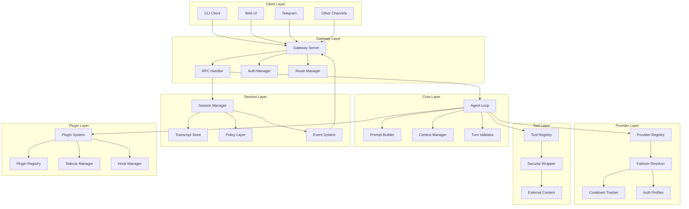
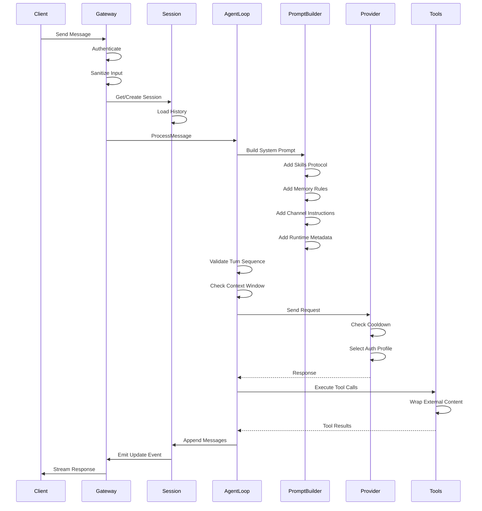
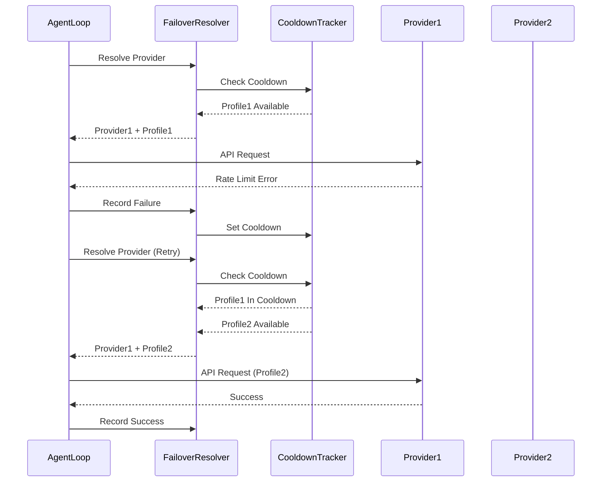

# Technical Design Document: RavBot Core Alignment

## Introduction

本设计文档定义了 RavBot 核心对齐项目的技术架构和实现策略。该项目旨在将 RavBot 的核心运行时逻辑提升至与 OpenClaw 相当的成熟度，重点关注五个优先级领域：

1. Core 模块增强（Prompt Builder 和 Agent Loop）
2. Gateway/Session/Channel 集成升级
3. 外部内容安全层
4. Plugin/Control-Plane 架构深化
5. Provider 弹性改进

### 设计目标

- 实现与 OpenClaw 功能对等的核心运行时逻辑
- 提升系统在多轮对话、多渠道、多工具和降级提供商条件下的可靠性
- 建立完整的安全防护机制，特别是外部内容安全层
- 深化插件和控制平面的架构
- 改进提供商弹性和故障恢复能力

### 设计约束

- 保持与现有 RavBot 架构的兼容性
- 遵循 Google C++ 代码风格
- 参考 OpenClaw 的实现模式，但适配 C++ 语言特性
- 考虑性能和内存效率
- 支持跨平台（Linux、macOS、Windows）

### 参考文档

- [Requirements Document](requirements.md)
- [Functional Logic Diff](../../func_logic_diff.md)
- OpenClaw 源码：`/home/rogers/develop/openclaw`

## Overview

RavBot 当前已具备基本的架构框架，包括 agent loop、gateway RPC、session transcripts、tool registry、provider abstraction、channel adapters、plugin sidecar 和基础沙箱。但在逻辑深度上与 OpenClaw 存在显著差距。

本设计将通过以下方式缩小差距：

1. **Prompt Builder 重构**：引入技能协议、内存召回策略、渠道指令、发送者信任模型和运行时元数据
2. **Agent Loop 增强**：添加认证配置轮换、冷却跟踪、上下文窗口保护、Turn 验证器和重试/故障转移逻辑
3. **Gateway 升级**：实现路由元数据、消息清理、中止语义和 Transcript 事件系统
4. **Channel 深化**：为 Telegram 添加去重、顺序处理和线程绑定
5. **Security 强化**：构建外部内容包装器、边界标记和信任模型
6. **Plugin 扩展**：完善清单注册表、冲突诊断、全局钩子和 Sidecar 生命周期管理


## Architecture

### System Architecture Overview



### Module Interaction Flow

#### 1. Message Processing Flow



#### 2. Failover and Retry Flow



### Data Flow Architecture

1. **Inbound Flow**: Client → Gateway → Session → Agent Loop → Provider
2. **Outbound Flow**: Provider → Agent Loop → Session → Gateway → Client
3. **Event Flow**: Session → Event System → Gateway → Subscribed Clients
4. **Tool Flow**: Agent Loop → Tool Registry → Security Wrapper → External Services


## Components and Interfaces

### 1. Core Module Components

#### 1.1 Enhanced Prompt Builder

**Purpose**: 构建完整的系统提示词，包含技能协议、内存规则、渠道指令、运行时元数据等。

**Interface**:

```cpp
class PromptBuilder {
public:
    // Build full system prompt with all components
    std::string BuildFull(const std::string& agent_id = "default",
                          const PromptContext& context = {}) const;
    
    // Build minimal prompt (identity + tools only)
    std::string BuildMinimal(const std::string& agent_id = "default") const;
    
    // Build with specific components
    std::string BuildWithComponents(const PromptComponents& components) const;
    
    // Set channel-specific instructions
    void SetChannelInstructions(const std::string& channel,
                                const std::string& instructions);
    
    // Set sender trust level
    void SetSenderTrust(const std::string& sender_id, TrustLevel level);
    
private:
    std::string build_skills_protocol() const;
    std::string build_memory_recall_rules() const;
    std::string build_channel_instructions(const std::string& channel) const;
    std::string build_runtime_metadata() const;
    std::string build_sender_trust_info(const std::string& sender_id) const;
    std::string build_output_constraints() const;
    std::string build_operation_guards() const;
    std::string build_tool_summary() const;  // For >100 tools
};

struct PromptContext {
    std::string channel;
    std::string sender_id;
    std::string session_key;
    int tool_count = 0;
    int context_window_size = 0;
    std::map<std::string, std::string> metadata;
};

struct PromptComponents {
    bool include_skills_protocol = true;
    bool include_memory_rules = true;
    bool include_channel_instructions = true;
    bool include_runtime_metadata = true;
    bool include_sender_trust = true;
    bool include_output_constraints = true;
    bool include_operation_guards = true;
    bool use_tool_summary = false;  // Auto-detect if tool_count > 100
};

enum class TrustLevel {
    kTrusted,      // Verified users, admins
    kSemiTrusted,  // Regular users
    kUntrusted     // Unknown or suspicious users
};
```

**Key Enhancements**:

1. **Skills Protocol Section**: 定义技能调用格式和参数规范
2. **Memory Recall Rules**: 指导何时以及如何检索历史记忆
3. **Channel Instructions**: 渠道特定的行为指令（如 Telegram 回复模式）
4. **Runtime Metadata**: 当前时间、工作空间、平台、可用工具摘要、会话状态
5. **Sender Trust**: 区分可信用户和普通用户
6. **Output Constraints**: 指导助手如何格式化响应
7. **Operation Guards**: 定义危险操作的审批流程
8. **Tool Summary**: 当工具超过 100 个时使用摘要而非完整 schema

#### 1.2 Enhanced Agent Loop

**Purpose**: 处理消息、工具调用和提供商交互，包含重试、故障转移和上下文窗口保护。

**Interface**:

```cpp
class AgentLoop {
public:
    // Process message with retry and failover
    std::vector<Message> ProcessMessage(
        const std::string& message,
        const std::vector<Message>& history,
        const std::string& system_prompt,
        const std::string& usage_session_key = "");
    
    // Streaming version
    std::vector<Message> ProcessMessageStream(
        const std::string& message,
        const std::vector<Message>& history,
        const std::string& system_prompt,
        AgentEventCallback callback,
        const std::string& usage_session_key = "");
    
    // Set failover resolver for multi-profile rotation
    void SetFailoverResolver(FailoverResolver* resolver);
    
    // Set context pruner for window protection
    void SetContextPruner(std::shared_ptr<ContextPruner> pruner);
    
    // Set turn validator for provider-specific fixes
    void SetTurnValidator(std::shared_ptr<TurnValidator> validator);
    
private:
    // Estimate total token count
    int estimate_tokens(const std::string& system_prompt,
                       const std::vector<Message>& history) const;
    
    // Compress history if needed
    std::vector<Message> compress_history(
        const std::vector<Message>& history,
        int target_tokens) const;
    
    // Validate and fix turn sequence
    std::vector<Message> validate_turns(
        const std::vector<Message>& messages,
        const std::string& provider_id) const;
    
    // Execute with retry and failover
    LLMResponse execute_with_retry(
        const std::string& system_prompt,
        const std::vector<Message>& messages,
        int max_retries = 3);
};
```

**Key Enhancements**:

1. **Auth Profile Rotation**: 通过 FailoverResolver 支持多个 API 密钥轮换
2. **Cooldown Tracking**: 失败的配置进入冷却期，自动切换到备用配置
3. **Context Window Protection**: 估算 token 数量，超过 90% 时自动压缩
4. **Turn Validation**: 针对不同提供商修复消息序列问题
5. **Retry Logic**: 可重试错误自动重试，使用指数退避
6. **Failover Logic**: 所有重试失败后切换到备用提供商

#### 1.3 Context Pruner

**Purpose**: 管理上下文窗口，防止超出 LLM 处理能力。

**Interface**:

```cpp
class ContextPruner {
public:
    // Estimate token count for text
    int EstimateTokens(const std::string& text) const;
    
    // Estimate tokens for messages
    int EstimateTokens(const std::vector<Message>& messages) const;
    
    // Compress messages to fit target token count
    std::vector<Message> Compress(
        const std::vector<Message>& messages,
        int target_tokens,
        const CompressionStrategy& strategy = {}) const;
    
    // Truncate long tool results
    std::string TruncateToolResult(
        const std::string& result,
        int max_chars = 10000) const;
    
private:
    // Token estimation model (simple heuristic or tiktoken)
    int tokens_per_char_ = 4;  // Conservative estimate
};

struct CompressionStrategy {
    bool preserve_recent = true;      // Keep recent messages
    bool preserve_tool_calls = true;  // Keep tool calls and results
    bool preserve_system = true;      // Keep system messages
    int min_messages = 5;             // Minimum messages to keep
};
```

#### 1.4 Turn Validator

**Purpose**: 验证和修复提供商特定的消息序列问题。

**Interface**:

```cpp
class TurnValidator {
public:
    // Validate and fix message sequence for a provider
    std::vector<Message> ValidateAndFix(
        const std::vector<Message>& messages,
        const std::string& provider_id) const;
    
    // Register provider-specific validator
    void RegisterValidator(
        const std::string& provider_id,
        ProviderValidator validator);
    
private:
    // Anthropic: ensure user/assistant alternation
    std::vector<Message> fix_anthropic_turns(
        const std::vector<Message>& messages) const;
    
    // Google: merge consecutive same-role messages
    std::vector<Message> fix_google_turns(
        const std::vector<Message>& messages) const;
    
    std::map<std::string, ProviderValidator> validators_;
};

using ProviderValidator = std::function<std::vector<Message>(
    const std::vector<Message>&)>;
```

### 2. Gateway/Session/Channel Components

#### 2.1 Enhanced Gateway Server

**Purpose**: 处理客户端连接、消息路由、中止语义和事件推送。

**Interface**:

```cpp
class GatewayServer {
public:
    // Send event to specific connection
    void SendEventTo(const std::string& connection_id, const RpcEvent& event);
    
    // Broadcast event to all connections
    void BroadcastEvent(const std::string& event, const nlohmann::json& payload);
    
    // Abort ongoing request
    bool AbortRequest(const std::string& request_id);
    
    // Set message sanitizer
    void SetMessageSanitizer(std::shared_ptr<MessageSanitizer> sanitizer);
    
    // Set route manager
    void SetRouteManager(std::shared_ptr<RouteManager> route_manager);
    
private:
    // Sanitize incoming message
    nlohmann::json sanitize_message(const nlohmann::json& message);
    
    // Attach delivery metadata
    nlohmann::json attach_route_metadata(
        const nlohmann::json& message,
        const std::string& source_channel,
        const std::string& target_session);
    
    std::shared_ptr<MessageSanitizer> sanitizer_;
    std::shared_ptr<RouteManager> route_manager_;
    std::map<std::string, std::shared_ptr<std::atomic<bool>>> abort_flags_;
};
```

**Key Enhancements**:

1. **Route Metadata**: 为每条消息附加来源、目标、时间戳、消息 ID
2. **Message Sanitization**: 移除潜在的恶意内容，规范化附件格式
3. **Abort Semantics**: 支持中止正在进行的 AI 请求
4. **Event System**: 实时推送 transcript 更新事件到客户端


#### 2.2 Message Sanitizer

**Purpose**: 清理和规范化消息内容，防止注入攻击。

**Interface**:

```cpp
class MessageSanitizer {
public:
    // Sanitize user input
    std::string SanitizeInput(const std::string& input) const;
    
    // Remove boundary markers from user input
    std::string RemoveBoundaryMarkers(const std::string& input) const;
    
    // Normalize attachment format
    nlohmann::json NormalizeAttachment(const nlohmann::json& attachment) const;
    
    // Validate message structure
    bool ValidateMessage(const nlohmann::json& message) const;
    
private:
    // Known boundary marker patterns
    std::vector<std::string> boundary_patterns_;
    
    // Maximum message size
    size_t max_message_size_ = 100000;
};
```

#### 2.3 Route Manager

**Purpose**: 管理消息路由和交付元数据。

**Interface**:

```cpp
class RouteManager {
public:
    // Attach route metadata to message
    RouteMetadata AttachMetadata(
        const std::string& source_channel,
        const std::string& target_session,
        const std::string& message_id = "") const;
    
    // Inherit route from parent message
    RouteMetadata InheritRoute(const RouteMetadata& parent) const;
    
    // Record delivery status
    void RecordDelivery(
        const std::string& message_id,
        DeliveryStatus status);
    
    // Query delivery status
    std::optional<DeliveryStatus> GetDeliveryStatus(
        const std::string& message_id) const;
    
private:
    std::map<std::string, DeliveryStatus> delivery_log_;
    mutable std::shared_mutex mutex_;
};

struct RouteMetadata {
    std::string source_channel;  // "telegram", "cli", "internal"
    std::string target_session;
    std::string message_id;
    std::string timestamp;
    MessagePriority priority = MessagePriority::kNormal;
    
    nlohmann::json ToJson() const;
    static RouteMetadata FromJson(const nlohmann::json& j);
};

enum class DeliveryStatus {
    kPending,
    kDelivered,
    kFailed,
    kAborted
};

enum class MessagePriority {
    kLow,
    kNormal,
    kHigh,
    kUrgent
};
```

#### 2.4 Enhanced Session Manager

**Purpose**: 管理会话、transcript 和策略，支持事件系统。

**Interface**:

```cpp
class SessionManager {
public:
    // Existing methods...
    
    // Set session policy
    void SetPolicy(const std::string& session_key, const SessionPolicy& policy);
    
    // Get session policy
    SessionPolicy GetPolicy(const std::string& session_key) const;
    
    // Subscribe to transcript events
    void Subscribe(const std::string& session_key,
                   TranscriptEventCallback callback);
    
    // Unsubscribe from events
    void Unsubscribe(const std::string& session_key,
                     const std::string& subscription_id);
    
private:
    // Emit transcript event
    void emit_event(const std::string& session_key,
                   const TranscriptEvent& event);
    
    // Policy store
    std::map<std::string, SessionPolicy> policies_;
    
    // Event subscribers
    std::map<std::string, std::vector<TranscriptSubscription>> subscribers_;
    mutable std::shared_mutex policy_mutex_;
    mutable std::shared_mutex subscriber_mutex_;
};

struct SessionPolicy {
    std::optional<std::string> model_override;
    std::vector<std::string> tool_whitelist;
    std::optional<std::string> output_format;
    std::optional<int> rate_limit;  // Messages per minute
    std::map<std::string, std::string> custom_settings;
    
    nlohmann::json ToJson() const;
    static SessionPolicy FromJson(const nlohmann::json& j);
};

struct TranscriptEvent {
    std::string event_type;  // "message_added", "message_modified", "message_deleted"
    std::string session_key;
    std::string timestamp;
    nlohmann::json data;
};

using TranscriptEventCallback = std::function<void(const TranscriptEvent&)>;

struct TranscriptSubscription {
    std::string id;
    TranscriptEventCallback callback;
};
```

#### 2.5 Enhanced Telegram Channel

**Purpose**: 处理 Telegram 消息，支持去重、顺序处理和线程绑定。

**Interface**:

```cpp
class TelegramChannel : public Channel {
public:
    // Existing methods...
    
    // Set deduplication store
    void SetDeduplicationStore(std::shared_ptr<DeduplicationStore> store);
    
    // Set lane processor for sequential handling
    void SetLaneProcessor(std::shared_ptr<LaneProcessor> processor);
    
    // Set thread binder for topic support
    void SetThreadBinder(std::shared_ptr<ThreadBinder> binder);
    
private:
    // Check if update is duplicate
    bool is_duplicate(int64_t update_id) const;
    
    // Record processed update
    void record_update(int64_t update_id);
    
    // Get lane ID for message (chat_id for sequential processing)
    std::string get_lane_id(const nlohmann::json& message) const;
    
    // Extract thread ID from message
    std::optional<std::string> extract_thread_id(
        const nlohmann::json& message) const;
    
    std::shared_ptr<DeduplicationStore> dedup_store_;
    std::shared_ptr<LaneProcessor> lane_processor_;
    std::shared_ptr<ThreadBinder> thread_binder_;
};
```

#### 2.6 Deduplication Store

**Purpose**: 持久化存储已处理的 update_id，防止重复处理。

**Interface**:

```cpp
class DeduplicationStore {
public:
    // Check if update_id has been processed
    bool IsProcessed(int64_t update_id) const;
    
    // Mark update_id as processed
    void MarkProcessed(int64_t update_id);
    
    // Get current watermark (highest processed update_id)
    int64_t GetWatermark() const;
    
    // Set watermark
    void SetWatermark(int64_t watermark);
    
    // Clean up old entries (keep last 7 days)
    void Cleanup(std::chrono::hours retention = std::chrono::hours(168));
    
    // Persist to disk
    void Save();
    
    // Load from disk
    void Load();
    
private:
    std::filesystem::path store_path_;
    int64_t watermark_ = 0;
    std::set<int64_t> processed_ids_;
    mutable std::shared_mutex mutex_;
};
```

#### 2.7 Lane Processor

**Purpose**: 确保同一聊天的消息按顺序处理，不同聊天可并发处理。

**Interface**:

```cpp
class LaneProcessor {
public:
    // Submit message to lane for sequential processing
    void Submit(const std::string& lane_id,
               std::function<void()> handler);
    
    // Get lane queue size
    size_t GetQueueSize(const std::string& lane_id) const;
    
    // Shutdown all lanes
    void Shutdown();
    
private:
    struct Lane {
        std::queue<std::function<void()>> queue;
        std::thread worker;
        std::mutex mutex;
        std::condition_variable cv;
        std::atomic<bool> running{true};
    };
    
    std::map<std::string, std::unique_ptr<Lane>> lanes_;
    mutable std::shared_mutex lanes_mutex_;
};
```

#### 2.8 Thread Binder

**Purpose**: 将 Telegram 线程 ID 映射到独立的会话。

**Interface**:

```cpp
class ThreadBinder {
public:
    // Get session key for thread
    std::string GetSessionKey(
        const std::string& chat_id,
        const std::optional<std::string>& thread_id) const;
    
    // Bind thread to session
    void BindThread(
        const std::string& chat_id,
        const std::string& thread_id,
        const std::string& session_key);
    
    // Unbind thread (when thread is deleted)
    void UnbindThread(
        const std::string& chat_id,
        const std::string& thread_id);
    
    // List all threads for a chat
    std::vector<ThreadBinding> ListThreads(const std::string& chat_id) const;
    
    // Persist bindings
    void Save();
    void Load();
    
private:
    struct ThreadBinding {
        std::string chat_id;
        std::string thread_id;
        std::string session_key;
        std::string created_at;
    };
    
    std::map<std::string, ThreadBinding> bindings_;
    std::filesystem::path store_path_;
    mutable std::shared_mutex mutex_;
};
```

### 3. Security Components

#### 3.1 External Content Wrapper

**Purpose**: 包装外部内容，防止 prompt injection 攻击。

**Interface**:

```cpp
class ExternalContentWrapper {
public:
    // Wrap external content with boundary markers
    std::string Wrap(
        const std::string& content,
        const ContentSource& source) const;
    
    // Unwrap content (for testing/debugging)
    std::optional<std::string> Unwrap(const std::string& wrapped) const;
    
    // Validate boundary markers
    bool ValidateMarkers(const std::string& wrapped) const;
    
    // Get boundary marker explanation for system prompt
    std::string GetMarkerExplanation() const;
    
private:
    // Generate unique boundary markers
    std::string start_marker() const;
    std::string end_marker() const;
    
    // Boundary markers using special Unicode characters
    static constexpr const char* kStartMarker = "⟦EXTERNAL_CONTENT_START⟧";
    static constexpr const char* kEndMarker = "⟦EXTERNAL_CONTENT_END⟧";
};

struct ContentSource {
    std::string tool_name;
    std::string url;
    std::string timestamp;
    TrustLevel trust_level;
};
```


#### 3.2 Trust Model Manager

**Purpose**: 管理内容来源的信任级别。

**Interface**:

```cpp
class TrustModelManager {
public:
    // Get trust level for content source
    TrustLevel GetTrustLevel(const ContentSource& source) const;
    
    // Set trust level for tool
    void SetToolTrustLevel(const std::string& tool_name, TrustLevel level);
    
    // Set trust level for sender
    void SetSenderTrustLevel(const std::string& sender_id, TrustLevel level);
    
    // Get security policy for trust level
    SecurityPolicy GetPolicy(TrustLevel level) const;
    
private:
    std::map<std::string, TrustLevel> tool_trust_;
    std::map<std::string, TrustLevel> sender_trust_;
    std::map<TrustLevel, SecurityPolicy> policies_;
    mutable std::shared_mutex mutex_;
};

struct SecurityPolicy {
    bool require_wrapping = true;
    bool require_approval = false;
    bool enable_sandboxing = true;
    int max_content_size = 100000;
    std::vector<std::string> allowed_operations;
};
```

#### 3.3 Security Audit Logger

**Purpose**: 记录所有安全相关的操作和事件。

**Interface**:

```cpp
class SecurityAuditLogger {
public:
    // Log external content wrapping
    void LogContentWrapping(
        const std::string& tool_name,
        const std::string& content_hash,
        size_t content_size);
    
    // Log marker sanitization
    void LogMarkerSanitization(
        const std::string& user_id,
        const std::string& removed_markers);
    
    // Log dangerous tool call
    void LogDangerousToolCall(
        const std::string& user_id,
        const std::string& tool_name,
        const nlohmann::json& args);
    
    // Log auth failure
    void LogAuthFailure(
        const std::string& provider_id,
        const std::string& error_message);
    
    // Log policy change
    void LogPolicyChange(
        const std::string& session_key,
        const nlohmann::json& old_policy,
        const nlohmann::json& new_policy);
    
    // Export audit log
    std::vector<AuditEntry> Export(
        const std::string& start_time,
        const std::string& end_time,
        const std::vector<std::string>& event_types = {}) const;
    
    // Rotate log files
    void Rotate();
    
private:
    std::filesystem::path log_dir_;
    std::shared_ptr<spdlog::logger> logger_;
};

struct AuditEntry {
    std::string timestamp;
    std::string event_type;
    std::string user_id;
    nlohmann::json details;
    
    nlohmann::json ToJson() const;
};
```

### 4. Provider Resilience Components

#### 4.1 Enhanced Failover Resolver

**Purpose**: 协调多配置密钥轮换和模型故障转移链。

**Interface** (已存在，需增强):

```cpp
class FailoverResolver {
public:
    // Existing methods...
    
    // Set retry configuration
    void SetRetryConfig(const RetryConfig& config);
    
    // Get failover statistics
    FailoverStats GetStats() const;
    
    // Reset all cooldowns (for testing/admin)
    void ResetCooldowns();
    
private:
    RetryConfig retry_config_;
    FailoverStats stats_;
};

struct RetryConfig {
    int max_retries = 3;
    std::chrono::seconds initial_backoff{1};
    double backoff_multiplier = 2.0;
    std::chrono::seconds max_backoff{60};
};

struct FailoverStats {
    int total_requests = 0;
    int successful_requests = 0;
    int failed_requests = 0;
    int failover_count = 0;
    std::map<std::string, int> provider_usage;
    std::map<std::string, int> profile_usage;
    
    nlohmann::json ToJson() const;
};
```

#### 4.2 Enhanced Cooldown Tracker

**Purpose**: 跟踪每个配置的冷却状态，支持指数退避。

**Interface** (已存在，需增强):

```cpp
class CooldownTracker {
public:
    // Existing methods...
    
    // Get all cooldown states
    std::vector<CooldownState> GetAllStates() const;
    
    // Get cooldown statistics
    CooldownStats GetStats() const;
    
private:
    CooldownStats stats_;
};

struct CooldownStats {
    int total_cooldowns = 0;
    int active_cooldowns = 0;
    std::map<std::string, int> cooldown_by_error;
    std::chrono::seconds total_cooldown_time{0};
    
    nlohmann::json ToJson() const;
};
```

### 5. Plugin System Components

#### 5.1 Enhanced Plugin Registry

**Purpose**: 管理插件清单、检测冲突、支持热重载。

**Interface**:

```cpp
class PluginRegistry {
public:
    // Load plugin manifest
    bool LoadManifest(const std::filesystem::path& manifest_path);
    
    // Get plugin by name
    std::optional<PluginManifest> GetPlugin(const std::string& name) const;
    
    // List all plugins
    std::vector<PluginManifest> ListPlugins() const;
    
    // Detect conflicts
    std::vector<PluginConflict> DetectConflicts() const;
    
    // Resolve tool name (with namespace)
    std::string ResolveToolName(
        const std::string& tool_name,
        const std::string& plugin_name = "") const;
    
    // Enable/disable plugin
    void SetPluginEnabled(const std::string& name, bool enabled);
    
    // Check if plugin is enabled
    bool IsPluginEnabled(const std::string& name) const;
    
private:
    std::map<std::string, PluginManifest> plugins_;
    std::set<std::string> disabled_plugins_;
    mutable std::shared_mutex mutex_;
};

struct PluginManifest {
    std::string name;
    std::string version;
    std::string description;
    std::string entry_point;
    std::vector<std::string> dependencies;
    std::vector<ToolDefinition> tools;
    std::vector<HookRegistration> hooks;
    nlohmann::json metadata;
    
    nlohmann::json ToJson() const;
    static PluginManifest FromJson(const nlohmann::json& j);
};

struct PluginConflict {
    std::string type;  // "tool_name", "hook_priority", "dependency"
    std::vector<std::string> affected_plugins;
    std::string description;
};

struct ToolDefinition {
    std::string name;
    std::string description;
    nlohmann::json schema;
};

struct HookRegistration {
    std::string hook_name;
    int priority = 0;
};
```

#### 5.2 Enhanced Hook Manager

**Purpose**: 管理全局钩子，支持优先级和异常处理。

**Interface**:

```cpp
class HookManager {
public:
    // Register hook handler
    void RegisterHook(
        const std::string& hook_name,
        const std::string& plugin_name,
        HookHandler handler,
        int priority = 0);
    
    // Unregister hook
    void UnregisterHook(
        const std::string& hook_name,
        const std::string& plugin_name);
    
    // Fire hook (synchronous)
    HookResult FireHook(
        const std::string& hook_name,
        const nlohmann::json& data);
    
    // Fire hook (asynchronous)
    std::future<HookResult> FireHookAsync(
        const std::string& hook_name,
        const nlohmann::json& data);
    
    // List registered hooks
    std::vector<HookInfo> ListHooks() const;
    
private:
    struct HookEntry {
        std::string plugin_name;
        HookHandler handler;
        int priority;
    };
    
    std::map<std::string, std::vector<HookEntry>> hooks_;
    mutable std::shared_mutex mutex_;
};

using HookHandler = std::function<HookResult(const nlohmann::json&)>;

struct HookResult {
    bool success = true;
    bool stop_propagation = false;
    nlohmann::json data;
    std::string error_message;
};

struct HookInfo {
    std::string hook_name;
    std::string plugin_name;
    int priority;
};
```

#### 5.3 Enhanced Sidecar Manager

**Purpose**: 管理 Sidecar 进程生命周期，支持健康检查和自动重启。

**Interface**:

```cpp
class SidecarManager {
public:
    // Start sidecar process
    bool Start(const SidecarConfig& config);
    
    // Stop sidecar process
    void Stop();
    
    // Restart sidecar process
    bool Restart();
    
    // Check if sidecar is running
    bool IsRunning() const;
    
    // Get sidecar status
    SidecarStatus GetStatus() const;
    
    // Set health check interval
    void SetHealthCheckInterval(std::chrono::seconds interval);
    
    // Set max restart attempts
    void SetMaxRestartAttempts(int max_attempts);
    
private:
    // Health check loop
    void health_check_loop();
    
    // Restart sidecar after crash
    bool auto_restart();
    
    std::unique_ptr<std::thread> health_check_thread_;
    std::atomic<bool> running_{false};
    std::atomic<int> restart_count_{0};
    int max_restart_attempts_ = 5;
    std::chrono::seconds health_check_interval_{30};
};

struct SidecarConfig {
    std::filesystem::path executable_path;
    std::vector<std::string> args;
    std::map<std::string, std::string> env;
    int port = 0;  // 0 = auto-assign
};

struct SidecarStatus {
    bool running = false;
    int pid = 0;
    int restart_count = 0;
    std::string last_error;
    std::chrono::system_clock::time_point started_at;
    std::chrono::system_clock::time_point last_health_check;
    
    nlohmann::json ToJson() const;
};
```


## Data Models

### 1. Configuration Data Models

#### 1.1 Enhanced Agent Config

```cpp
struct AgentConfig {
    std::string model = "anthropic/claude-sonnet-4-6";
    int max_iterations = 15;
    int context_window = 200000;
    double temperature = 0.7;
    int max_tokens = 4096;
    
    // New fields for alignment
    bool enable_memory = true;
    bool enable_skills = true;
    bool enable_context_pruning = true;
    bool enable_turn_validation = true;
    int context_window_threshold_percent = 90;
    
    nlohmann::json ToJson() const;
    static AgentConfig FromJson(const nlohmann::json& j);
};
```

#### 1.2 Provider Auth Profile

```cpp
struct AuthProfile {
    std::string id;           // "prod", "backup", "dev"
    std::string api_key;      // Direct key value
    std::string api_key_env;  // Env var name
    int priority = 0;         // Higher = preferred
    bool enabled = true;
    
    nlohmann::json ToJson() const;
    static AuthProfile FromJson(const nlohmann::json& j);
};
```

#### 1.3 Failover Chain Config

```cpp
struct FailoverChainConfig {
    std::vector<std::string> models;  // In priority order
    RetryConfig retry_config;
    std::map<std::string, std::vector<AuthProfile>> provider_profiles;
    
    nlohmann::json ToJson() const;
    static FailoverChainConfig FromJson(const nlohmann::json& j);
};
```

#### 1.4 Channel Config Extensions

```cpp
struct TelegramConfig {
    // Existing fields...
    
    // New fields for alignment
    bool enable_deduplication = true;
    bool enable_sequential_lanes = true;
    bool enable_thread_binding = true;
    std::filesystem::path dedup_store_path;
    std::filesystem::path thread_binding_path;
    int lane_queue_size = 100;
    
    nlohmann::json ToJson() const;
    static TelegramConfig FromJson(const nlohmann::json& j);
};
```

### 2. Runtime Data Models

#### 2.1 Message with Route Metadata

```cpp
struct Message {
    std::string role;  // "user", "assistant", "system", "tool"
    std::vector<ContentBlock> content;
    std::optional<std::string> name;  // For tool results
    std::optional<std::string> tool_call_id;
    
    // New: route metadata
    std::optional<RouteMetadata> route;
    
    nlohmann::json ToJson() const;
    static Message FromJson(const nlohmann::json& j);
};
```

#### 2.2 Transcript Event

```cpp
struct TranscriptEvent {
    std::string event_type;  // "message_added", "message_modified", "message_deleted"
    std::string session_key;
    std::string timestamp;
    nlohmann::json data;
    
    nlohmann::json ToJson() const;
    static TranscriptEvent FromJson(const nlohmann::json& j);
};
```

#### 2.3 Cooldown State

```cpp
struct CooldownState {
    int consecutive_failures = 0;
    ProviderErrorKind last_error = ProviderErrorKind::kUnknown;
    std::chrono::steady_clock::time_point cooldown_until;
    std::chrono::steady_clock::time_point last_failure_at;
    std::chrono::steady_clock::time_point last_probe_at;
    
    bool IsInCooldown() const {
        return std::chrono::steady_clock::now() < cooldown_until;
    }
    
    std::chrono::seconds RemainingTime() const {
        auto now = std::chrono::steady_clock::now();
        if (now >= cooldown_until) return std::chrono::seconds(0);
        return std::chrono::duration_cast<std::chrono::seconds>(
            cooldown_until - now);
    }
};
```

#### 2.4 Plugin Manifest

```cpp
struct PluginManifest {
    std::string name;
    std::string version;
    std::string description;
    std::string author;
    std::string license;
    std::string entry_point;
    std::vector<std::string> dependencies;
    std::vector<ToolDefinition> tools;
    std::vector<HookRegistration> hooks;
    std::vector<std::string> required_permissions;
    nlohmann::json metadata;
    
    // Validation
    bool IsValid() const;
    std::vector<std::string> Validate() const;
    
    nlohmann::json ToJson() const;
    static PluginManifest FromJson(const nlohmann::json& j);
};
```

### 3. Persistent Data Models

#### 3.1 Deduplication Store Format

**File**: `~/.ravbot/channels/telegram/dedup.json`

```json
{
  "watermark": 123456789,
  "processed_ids": [123456780, 123456781, 123456782],
  "last_cleanup": "2025-01-15T10:30:00Z"
}
```

#### 3.2 Thread Binding Store Format

**File**: `~/.ravbot/channels/telegram/threads.json`

```json
{
  "bindings": [
    {
      "chat_id": "-1001234567890",
      "thread_id": "42",
      "session_key": "agent:main:telegram-chat--1001234567890-thread-42",
      "created_at": "2025-01-15T10:30:00Z"
    }
  ]
}
```

#### 3.3 Session Policy Store Format

**File**: `~/.ravbot/sessions/<session_id>/policy.json`

```json
{
  "model_override": "anthropic/claude-opus-4-6",
  "tool_whitelist": ["read", "write", "web_search"],
  "output_format": "markdown",
  "rate_limit": 10,
  "custom_settings": {
    "thinking_level": "extended",
    "language": "zh-CN"
  }
}
```

#### 3.4 Audit Log Format

**File**: `~/.ravbot/logs/audit/<date>.jsonl`

```jsonl
{"timestamp":"2025-01-15T10:30:00Z","event_type":"content_wrapping","user_id":"user123","details":{"tool":"web_search","content_hash":"abc123","size":5000}}
{"timestamp":"2025-01-15T10:31:00Z","event_type":"marker_sanitization","user_id":"user456","details":{"removed_markers":["⟦EXTERNAL_CONTENT_START⟧"]}}
{"timestamp":"2025-01-15T10:32:00Z","event_type":"dangerous_tool_call","user_id":"user789","details":{"tool":"bash","args":{"command":"rm -rf /"}}}
```

### 4. API Data Models

#### 4.1 RPC Request/Response Extensions

```cpp
// New RPC methods for alignment features

// Abort request
struct AbortRequest {
    std::string request_id;
};

struct AbortResponse {
    bool success;
    std::string message;
};

// Subscribe to transcript events
struct SubscribeRequest {
    std::string session_key;
};

struct SubscribeResponse {
    std::string subscription_id;
};

// Set session policy
struct SetPolicyRequest {
    std::string session_key;
    SessionPolicy policy;
};

struct SetPolicyResponse {
    bool success;
};

// Get failover stats
struct GetFailoverStatsRequest {};

struct GetFailoverStatsResponse {
    FailoverStats stats;
};

// Get cooldown status
struct GetCooldownStatusRequest {};

struct GetCooldownStatusResponse {
    std::vector<CooldownState> states;
};
```

## Error Handling

### 1. Error Classification

```cpp
enum class ProviderErrorKind {
    kUnknown,
    kNetworkTimeout,
    kRateLimit,
    kAuthFailure,
    kInvalidRequest,
    kServiceUnavailable,
    kContextLengthExceeded,
    kContentPolicyViolation
};

// Determine if error is retryable
bool IsRetryable(ProviderErrorKind kind) {
    switch (kind) {
        case ProviderErrorKind::kNetworkTimeout:
        case ProviderErrorKind::kRateLimit:
        case ProviderErrorKind::kServiceUnavailable:
            return true;
        default:
            return false;
    }
}

// Get cooldown duration for error kind
std::chrono::seconds GetCooldownDuration(ProviderErrorKind kind, int failure_count) {
    switch (kind) {
        case ProviderErrorKind::kRateLimit:
            return std::chrono::seconds(300);  // 5 minutes
        case ProviderErrorKind::kAuthFailure:
            return std::chrono::seconds(3600);  // 1 hour
        case ProviderErrorKind::kServiceUnavailable:
            return std::chrono::seconds(60 * (1 << std::min(failure_count, 5)));  // Exponential
        default:
            return std::chrono::seconds(30);
    }
}
```

### 2. Error Recovery Strategies

```cpp
class ErrorRecoveryStrategy {
public:
    virtual ~ErrorRecoveryStrategy() = default;
    
    // Determine recovery action
    virtual RecoveryAction DetermineAction(
        const ProviderError& error,
        int attempt_count) const = 0;
};

enum class RecoveryAction {
    kRetry,           // Retry with same provider/profile
    kSwitchProfile,   // Switch to different auth profile
    kSwitchProvider,  // Failover to different provider
    kAbort            // Give up
};

class DefaultRecoveryStrategy : public ErrorRecoveryStrategy {
public:
    RecoveryAction DetermineAction(
        const ProviderError& error,
        int attempt_count) const override {
        
        if (!IsRetryable(error.kind)) {
            return RecoveryAction::kAbort;
        }
        
        if (attempt_count < 3) {
            if (error.kind == ProviderErrorKind::kRateLimit ||
                error.kind == ProviderErrorKind::kAuthFailure) {
                return RecoveryAction::kSwitchProfile;
            }
            return RecoveryAction::kRetry;
        }
        
        if (attempt_count < 6) {
            return RecoveryAction::kSwitchProvider;
        }
        
        return RecoveryAction::kAbort;
    }
};
```

### 3. Error Reporting

```cpp
struct ProviderError {
    ProviderErrorKind kind;
    std::string provider_id;
    std::string profile_id;
    std::string message;
    std::optional<int> retry_after_seconds;
    nlohmann::json details;
    
    nlohmann::json ToJson() const;
};

// Error context for debugging
struct ErrorContext {
    std::string request_id;
    std::string session_key;
    std::string model;
    int attempt_count;
    std::vector<ProviderError> errors;
    std::chrono::system_clock::time_point timestamp;
    
    nlohmann::json ToJson() const;
};
```


## Testing Strategy

### 1. Testing Approach

本项目采用双重测试策略：

- **Unit Tests**: 验证特定示例、边界情况和错误条件
- **Property-Based Tests**: 验证跨所有输入的通用属性

两种测试方法是互补的，共同提供全面的覆盖：
- Unit tests 捕获具体的 bug
- Property tests 验证通用的正确性

### 2. Property-Based Testing Configuration

**测试库选择**: Google Test + RapidCheck (C++ property-based testing library)

**配置要求**:
- 每个 property test 最少运行 100 次迭代（由于随机化）
- 每个 test 必须引用设计文档中的 property
- Tag 格式: `// Feature: ravbot-core-alignment, Property {number}: {property_text}`

**示例**:

```cpp
#include <rapidcheck.h>
#include <gtest/gtest.h>

// Feature: ravbot-core-alignment, Property 1: Config round-trip
TEST(ConfigParserTest, RoundTripProperty) {
    rc::check("parsing then formatting produces equivalent config", []() {
        auto config = *rc::gen::arbitrary<RavBotConfig>();
        auto json = config.ToJson();
        auto parsed = RavBotConfig::FromJson(json);
        RC_ASSERT(config == parsed);
    });
}
```

### 3. Unit Testing Strategy

#### 3.1 Core Module Tests

**Prompt Builder Tests**:
- 验证技能协议部分的生成
- 验证内存召回规则的包含
- 验证渠道指令的注入
- 验证运行时元数据的格式
- 验证工具摘要模式（>100 tools）

**Agent Loop Tests**:
- 验证上下文窗口保护触发
- 验证 turn 序列修复（Anthropic/Google）
- 验证重试逻辑和指数退避
- 验证故障转移到备用提供商
- 验证中止请求的处理

**Context Pruner Tests**:
- 验证 token 估算准确性
- 验证消息压缩策略
- 验证工具结果截断
- 验证系统提示词保留

**Turn Validator Tests**:
- 验证 Anthropic turn 修复（user/assistant 交替）
- 验证 Google turn 修复（合并同角色消息）
- 验证非法序列检测

#### 3.2 Gateway/Session/Channel Tests

**Gateway Tests**:
- 验证消息清理功能
- 验证路由元数据附加
- 验证中止语义
- 验证事件推送

**Session Manager Tests**:
- 验证策略设置和获取
- 验证事件订阅和取消订阅
- 验证 transcript 更新事件触发

**Telegram Channel Tests**:
- 验证去重功能（update_id 水位线）
- 验证顺序车道处理
- 验证线程绑定映射
- 验证持久化存储

#### 3.3 Security Tests

**External Content Wrapper Tests**:
- 验证边界标记包装
- 验证标记验证
- 验证标记清理

**Trust Model Tests**:
- 验证信任级别分配
- 验证安全策略应用

**Audit Logger Tests**:
- 验证审计日志记录
- 验证日志导出和过滤
- 验证日志轮转

#### 3.4 Provider Resilience Tests

**Failover Resolver Tests**:
- 验证配置轮换逻辑
- 验证会话固定（session pinning）
- 验证故障转移链遍历
- 验证成功/失败记录

**Cooldown Tracker Tests**:
- 验证冷却状态跟踪
- 验证指数退避计算
- 验证探测（probe）逻辑

#### 3.5 Plugin System Tests

**Plugin Registry Tests**:
- 验证清单加载和验证
- 验证冲突检测
- 验证工具名称解析（命名空间）

**Hook Manager Tests**:
- 验证钩子注册和优先级
- 验证钩子触发和异常处理
- 验证停止传播逻辑

**Sidecar Manager Tests**:
- 验证进程启动和停止
- 验证健康检查
- 验证自动重启逻辑

### 4. Integration Tests

**End-to-End Flow Tests**:
- 完整的消息处理流程（Client → Gateway → Agent Loop → Provider → Response）
- 故障转移场景（主提供商失败 → 备用提供商）
- 多轮对话场景（上下文窗口保护）
- 多渠道场景（Telegram 线程绑定）

**Smoke Tests**:
- Gateway 启动和 RPC 调用
- Session 创建和消息追加
- Provider 调用和响应
- Plugin 加载和工具调用

### 5. Performance Tests

**Load Tests**:
- 并发连接测试（100+ WebSocket 连接）
- 高频消息测试（10+ messages/second）
- 大上下文测试（接近 context window 限制）

**Memory Tests**:
- 长时间运行内存泄漏检测
- 大 transcript 内存使用
- Plugin 内存隔离

### 6. Test Coverage Goals

- **Core modules**: >80% line coverage
- **Gateway/Session**: >75% line coverage
- **Security**: >90% line coverage
- **Provider resilience**: >85% line coverage
- **Plugin system**: >70% line coverage

### 7. Continuous Testing

**Pre-commit**:
- 运行受影响模块的 unit tests
- 运行代码格式检查（clang-format）
- 运行静态分析（clang-tidy）

**CI Pipeline**:
- 运行完整的 unit test suite
- 运行 integration tests
- 运行 smoke tests
- 生成覆盖率报告

**Nightly**:
- 运行 property-based tests（更多迭代）
- 运行 performance tests
- 运行 memory leak detection


## Acceptance Criteria Testing Prework

### Requirement 1: 完整的系统提示词构建模型

1.1 THE Prompt_Builder SHALL 包含技能协议说明
  Thoughts: 这是测试提示词构建器输出的一个属性。我们可以生成随机的配置，构建提示词，然后验证输出包含技能协议部分。
  Testable: yes - property

1.2 THE Prompt_Builder SHALL 包含内存召回规则
  Thoughts: 类似 1.1，验证输出包含内存召回规则部分。
  Testable: yes - property

1.3 WHEN 构建提示词时，THE Prompt_Builder SHALL 包含渠道特定的行为指令
  Thoughts: 这是测试对于任意渠道，提示词都应包含该渠道的指令。
  Testable: yes - property

1.4 THE Prompt_Builder SHALL 包含运行时元数据
  Thoughts: 验证输出包含运行时元数据（时间、工作空间等）。
  Testable: yes - property

1.5 THE Prompt_Builder SHALL 包含发送者信任级别信息
  Thoughts: 对于任意发送者，提示词应包含其信任级别。
  Testable: yes - property

1.6 THE Prompt_Builder SHALL 包含输出格式约束
  Thoughts: 验证输出包含输出格式约束部分。
  Testable: yes - property

1.7 THE Prompt_Builder SHALL 包含操作防护规则
  Thoughts: 验证输出包含操作防护规则部分。
  Testable: yes - property

1.8 WHEN 工具列表超过 100 个时，THE Prompt_Builder SHALL 仅包含工具摘要
  Thoughts: 这是一个边界条件测试。当工具数量 > 100 时，应使用摘要模式。
  Testable: yes - example

1.9 THE Prompt_Builder SHALL 支持动态调整提示词内容以适应不同的上下文窗口限制
  Thoughts: 这是测试提示词长度应该根据上下文窗口限制进行调整。
  Testable: yes - property

### Requirement 2: 认证配置轮换和冷却机制

2.1 WHEN 一个 Auth_Profile 失败时，THE Provider SHALL 标记该配置进入 Cooldown 状态
  Thoughts: 对于任意配置，失败后应进入冷却状态。
  Testable: yes - property

2.2 WHILE 一个 Auth_Profile 处于 Cooldown 状态，THE Provider SHALL NOT 使用该配置
  Thoughts: 验证冷却期间不使用该配置。
  Testable: yes - property

2.3 WHEN Cooldown 期结束时，THE Provider SHALL 自动恢复该 Auth_Profile 的可用状态
  Thoughts: 这是一个时间相关的测试，验证冷却期结束后配置恢复。
  Testable: yes - property

2.4 THE Provider SHALL 支持为每个提供商配置多个 Auth_Profile
  Thoughts: 这是配置能力测试，验证可以添加多个配置。
  Testable: yes - example

2.5 WHEN 所有 Auth_Profile 都失败时，THE Provider SHALL 返回明确的错误信息
  Thoughts: 这是边界条件，所有配置都失败时的行为。
  Testable: yes - example

2.6 THE Provider SHALL 记录每个 Auth_Profile 的使用统计
  Thoughts: 验证统计信息被正确记录。
  Testable: yes - property

2.7 THE Provider SHALL 支持配置 Cooldown 时长
  Thoughts: 这是配置能力测试。
  Testable: yes - example

2.8 WHEN 检测到速率限制错误时，THE Provider SHALL 自动延长 Cooldown 时长
  Thoughts: 验证速率限制错误导致更长的冷却时间。
  Testable: yes - property

### Requirement 3: 上下文窗口保护和使用规范化

3.1 THE Agent_Loop SHALL 在发送请求前估算总 token 数量
  Thoughts: 验证 token 估算功能存在且被调用。
  Testable: yes - property

3.2 WHEN 估算的 token 数量超过模型 Context_Window 的 90% 时，THE Agent_Loop SHALL 触发压缩流程
  Thoughts: 这是阈值触发测试，验证超过 90% 时触发压缩。
  Testable: yes - property

3.3 THE Agent_Loop SHALL 优先保留最近的消息和工具调用结果
  Thoughts: 验证压缩策略保留最近的消息。
  Testable: yes - property

3.4 THE Agent_Loop SHALL 压缩或移除较旧的消息
  Thoughts: 验证压缩后消息数量减少。
  Testable: yes - property

3.5 THE Agent_Loop SHALL 保留系统提示词和工具 schema 的完整性
  Thoughts: 验证压缩后系统提示词和工具 schema 不变。
  Testable: yes - property

3.6 WHEN 单条工具结果超过 10000 字符时，THE Agent_Loop SHALL 截断该结果
  Thoughts: 这是边界条件，验证长工具结果被截断。
  Testable: yes - example

3.7 THE Agent_Loop SHALL 记录压缩操作的统计信息
  Thoughts: 验证统计信息被记录。
  Testable: yes - property

3.8 THE Agent_Loop SHALL 支持为不同模型配置不同的 Context_Window 大小
  Thoughts: 这是配置能力测试。
  Testable: yes - example

### Requirement 4: Provider-Specific Turn 验证器

4.1 THE Agent_Loop SHALL 在发送请求前验证消息序列的合法性
  Thoughts: 验证验证器被调用。
  Testable: yes - property

4.2 WHEN 使用 Anthropic 提供商时，THE Agent_Loop SHALL 确保消息序列以 user 角色开始
  Thoughts: 这是 Anthropic 特定的规则，验证修复后序列以 user 开始。
  Testable: yes - property

4.3 WHEN 使用 Anthropic 提供商时，THE Agent_Loop SHALL 确保 user 和 assistant 角色交替出现
  Thoughts: 验证 Anthropic 的交替规则。
  Testable: yes - property

4.4 WHEN 使用 Google 提供商时，THE Agent_Loop SHALL 将连续的同角色消息合并
  Thoughts: 验证 Google 的合并规则。
  Testable: yes - property

4.5 WHEN 检测到非法消息序列时，THE Agent_Loop SHALL 自动修复
  Thoughts: 验证修复功能。
  Testable: yes - property

4.6 THE Agent_Loop SHALL 记录所有消息序列修复操作到日志
  Thoughts: 验证日志记录。
  Testable: yes - property

4.7 WHEN 修复失败时，THE Agent_Loop SHALL 返回明确的错误信息
  Thoughts: 这是错误处理测试。
  Testable: yes - example

4.8 THE Agent_Loop SHALL 支持为新提供商添加自定义验证规则
  Thoughts: 这是扩展性测试。
  Testable: yes - example

### Requirement 5: 成熟的重试和故障转移逻辑

5.1 WHEN 提供商返回可重试错误时，THE Agent_Loop SHALL 自动重试
  Thoughts: 对于任意可重试错误，应该触发重试。
  Testable: yes - property

5.2 THE Agent_Loop SHALL 支持配置最大重试次数
  Thoughts: 这是配置能力测试。
  Testable: yes - example

5.3 THE Agent_Loop SHALL 在重试之间使用指数退避策略
  Thoughts: 验证重试间隔符合指数退避。
  Testable: yes - property

5.4 WHEN 所有重试都失败时，THE Agent_Loop SHALL 尝试 Failover 到备用提供商
  Thoughts: 验证故障转移逻辑。
  Testable: yes - property

5.5 THE Agent_Loop SHALL 支持配置 Failover 优先级列表
  Thoughts: 这是配置能力测试。
  Testable: yes - example

5.6 WHEN 不可重试错误发生时，THE Agent_Loop SHALL 立即返回错误
  Thoughts: 验证不可重试错误不触发重试。
  Testable: yes - property

5.7 THE Agent_Loop SHALL 记录所有重试和 Failover 操作到日志
  Thoughts: 验证日志记录。
  Testable: yes - property

5.8 THE Agent_Loop SHALL 在响应中包含使用的提供商信息
  Thoughts: 验证响应包含提供商信息。
  Testable: yes - property

### Requirement 21: 配置文件解析器和格式化器

21.1 WHEN 提供有效的 JSON 配置文件时，THE Config_Parser SHALL 解析为 RavBotConfig 对象
  Thoughts: 这是基本的解析功能测试。
  Testable: yes - property

21.2 WHEN 提供无效的 JSON 配置文件时，THE Config_Parser SHALL 返回描述性错误信息
  Thoughts: 这是错误处理测试。
  Testable: yes - property

21.3 THE Config_Formatter SHALL 将 RavBotConfig 对象格式化为有效的 JSON 配置文件
  Thoughts: 这是格式化功能测试。
  Testable: yes - property

21.4 FOR ALL 有效的 RavBotConfig 对象，解析、格式化、再解析 SHALL 产生等价的对象
  Thoughts: 这是经典的 round-trip property，最适合测试序列化/反序列化。
  Testable: yes - property

21.5 THE Config_Parser SHALL 支持配置文件验证
  Thoughts: 这是验证功能测试。
  Testable: yes - property

21.6 THE Config_Parser SHALL 支持配置文件合并
  Thoughts: 这是合并功能测试。
  Testable: yes - property

21.7 THE Config_Formatter SHALL 支持美化输出
  Thoughts: 这是格式化选项测试。
  Testable: yes - example

21.8 THE Config_Parser SHALL 支持配置文件注释
  Thoughts: 这是扩展功能测试。
  Testable: yes - example

### Requirement 22: 插件清单解析器和格式化器

22.1 WHEN 提供有效的插件 Manifest 文件时，THE Manifest_Parser SHALL 解析为 PluginManifest 对象
  Thoughts: 基本解析功能。
  Testable: yes - property

22.2 WHEN 提供无效的 Manifest 文件时，THE Manifest_Parser SHALL 返回描述性错误信息
  Thoughts: 错误处理。
  Testable: yes - property

22.3 THE Manifest_Formatter SHALL 将 PluginManifest 对象格式化为有效的 Manifest 文件
  Thoughts: 格式化功能。
  Testable: yes - property

22.4 FOR ALL 有效的 PluginManifest 对象，解析、格式化、再解析 SHALL 产生等价的对象
  Thoughts: Round-trip property。
  Testable: yes - property

22.5 THE Manifest_Parser SHALL 验证 Manifest 的 schema 版本兼容性
  Thoughts: 版本验证。
  Testable: yes - property

22.6 THE Manifest_Parser SHALL 验证插件依赖的有效性
  Thoughts: 依赖验证。
  Testable: yes - property

22.7 THE Manifest_Formatter SHALL 支持生成 Manifest 模板
  Thoughts: 模板生成功能。
  Testable: yes - example

22.8 THE Manifest_Parser SHALL 支持扩展字段
  Thoughts: 扩展性测试。
  Testable: yes - example

### Property Reflection

审查所有标记为 testable 的 properties，识别冗余：

**潜在冗余**:
- 1.1-1.7 都是验证提示词包含特定部分，可以合并为一个综合 property
- 3.3 和 3.4 都是关于压缩策略，可以合并
- 4.2 和 4.3 都是 Anthropic 特定规则，可以合并
- 5.7 和 4.6 都是日志记录，但针对不同功能，保留

**合并后的 properties**:
- Property 1: 提示词包含所有必需部分（合并 1.1-1.7）
- Property 2: 压缩策略正确保留/移除消息（合并 3.3-3.4）
- Property 3: Anthropic turn 验证规则（合并 4.2-4.3）

其他 properties 提供独特的验证价值，保留。


## Correctness Properties

*A property is a characteristic or behavior that should hold true across all valid executions of a system—essentially, a formal statement about what the system should do. Properties serve as the bridge between human-readable specifications and machine-verifiable correctness guarantees.*

### Property 1: Complete System Prompt Components

*For any* agent configuration and prompt context, the generated system prompt should contain all required components: skills protocol, memory recall rules, channel instructions (if channel specified), runtime metadata, sender trust information (if sender specified), output constraints, and operation guards.

**Validates: Requirements 1.1, 1.2, 1.3, 1.4, 1.5, 1.6, 1.7**

### Property 2: Tool Summary Mode Activation

*For any* prompt builder configuration, when the tool count exceeds 100, the generated prompt should use tool summary mode instead of including full tool schemas.

**Validates: Requirements 1.8**

### Property 3: Prompt Length Adaptation

*For any* context window size limit, the generated prompt should not exceed the specified limit, and should dynamically adjust content to fit within the constraint.

**Validates: Requirements 1.9**

### Property 4: Cooldown State Transition

*For any* auth profile, when a failure is recorded, the profile should transition to cooldown state, and should not be used until the cooldown period expires.

**Validates: Requirements 2.1, 2.2, 2.3**

### Property 5: Profile Usage Statistics

*For any* auth profile, all usage attempts (successful or failed) should be recorded in the usage statistics with correct counts and timestamps.

**Validates: Requirements 2.6**

### Property 6: Rate Limit Cooldown Extension

*For any* auth profile, when a rate limit error is detected, the cooldown duration should be longer than for other error types.

**Validates: Requirements 2.8**

### Property 7: Token Estimation Accuracy

*For any* message history and system prompt, the estimated token count should be within 20% of the actual token count (conservative estimate preferred).

**Validates: Requirements 3.1**

### Property 8: Context Window Compression Trigger

*For any* message history, when the estimated token count exceeds 90% of the context window size, the compression process should be triggered automatically.

**Validates: Requirements 3.2**

### Property 9: Compression Preservation Strategy

*For any* message history undergoing compression, the compressed result should preserve recent messages, tool calls and results, and system messages, while removing older conversational messages.

**Validates: Requirements 3.3, 3.4, 3.5**

### Property 10: Compression Statistics Recording

*For any* compression operation, statistics should be recorded including the number of messages removed and the number of tokens saved.

**Validates: Requirements 3.7**

### Property 11: Turn Sequence Validation

*For any* message sequence and provider ID, the turn validator should be invoked before sending the request, and should return a valid sequence for that provider.

**Validates: Requirements 4.1**

### Property 12: Anthropic Turn Sequence Rules

*For any* message sequence validated for Anthropic, the result should start with a user message and should alternate between user and assistant roles.

**Validates: Requirements 4.2, 4.3**

### Property 13: Google Turn Sequence Rules

*For any* message sequence validated for Google, consecutive messages with the same role should be merged into a single message.

**Validates: Requirements 4.4**

### Property 14: Turn Validation Logging

*For any* turn sequence that requires fixing, the validation operation and fix details should be logged.

**Validates: Requirements 4.6**

### Property 15: Retryable Error Retry

*For any* retryable error (network timeout, rate limit, service unavailable), the agent loop should attempt retry up to the configured maximum retry count.

**Validates: Requirements 5.1**

### Property 16: Exponential Backoff

*For any* retry sequence, the delay between retries should follow an exponential backoff pattern (e.g., 1s, 2s, 4s).

**Validates: Requirements 5.3**

### Property 17: Failover After Exhausted Retries

*For any* request where all retries fail, the agent loop should attempt failover to the next provider in the fallback chain.

**Validates: Requirements 5.4**

### Property 18: Non-Retryable Error Immediate Failure

*For any* non-retryable error (auth failure, invalid request), the agent loop should immediately return the error without retry attempts.

**Validates: Requirements 5.6**

### Property 19: Retry and Failover Logging

*For any* retry or failover operation, the operation should be logged with provider ID, profile ID, attempt count, and error details.

**Validates: Requirements 5.7**

### Property 20: Provider Information in Response

*For any* successful response, the response metadata should include the provider ID and profile ID that was used.

**Validates: Requirements 5.8**

### Property 21: Config Round-Trip Preservation

*For any* valid RavBotConfig object, serializing to JSON and then deserializing should produce an equivalent configuration object.

**Validates: Requirements 21.4**

### Property 22: Config Validation Error Messages

*For any* invalid configuration JSON, the parser should return a descriptive error message indicating what is invalid and where.

**Validates: Requirements 21.2**

### Property 23: Config Merge Correctness

*For any* two valid configuration objects, merging them should produce a valid configuration where later values override earlier values for the same keys.

**Validates: Requirements 21.6**

### Property 24: Manifest Round-Trip Preservation

*For any* valid PluginManifest object, serializing to JSON and then deserializing should produce an equivalent manifest object.

**Validates: Requirements 22.4**

### Property 25: Manifest Validation Error Messages

*For any* invalid manifest JSON, the parser should return a descriptive error message indicating what is invalid.

**Validates: Requirements 22.2**

### Property 26: Manifest Dependency Validation

*For any* plugin manifest with dependencies, the parser should validate that all dependencies are valid plugin names and versions.

**Validates: Requirements 22.6**

### Property 27: Boundary Marker Wrapping

*For any* external content from untrusted sources (web search, web fetch), the content should be wrapped with boundary markers before being included in the prompt.

**Validates: Requirements 12.2, 12.3**

### Property 28: Boundary Marker Sanitization

*For any* user input or channel message, all boundary markers should be removed before processing to prevent marker forgery.

**Validates: Requirements 13.1, 13.2**

### Property 29: Trust Level Assignment

*For any* content source, the trust model should assign an appropriate trust level (trusted, semi-trusted, untrusted) based on the source type.

**Validates: Requirements 14.1, 14.2, 14.3, 14.4, 14.5**

### Property 30: Telegram Update Deduplication

*For any* Telegram update with an update_id that has been processed before, the update should be skipped and not processed again.

**Validates: Requirements 9.1, 9.3**

### Property 31: Telegram Sequential Lane Processing

*For any* two messages from the same chat, they should be processed in the order they were received (sequential lane processing).

**Validates: Requirements 9.4**

### Property 32: Telegram Thread Binding

*For any* Telegram message with a message_thread_id, the message should be routed to a session that is bound to that specific thread.

**Validates: Requirements 10.1, 10.2, 10.3**

### Property 33: Session Policy Application

*For any* session with a configured policy, the agent loop should apply the policy settings (model override, tool whitelist, output format) when processing messages for that session.

**Validates: Requirements 11.1, 11.5**

### Property 34: Transcript Event Emission

*For any* transcript update (message added, modified, deleted), an event should be emitted to all subscribers of that session.

**Validates: Requirements 8.1, 8.2**

### Property 35: Route Metadata Attachment

*For any* message processed by the gateway, route metadata (source channel, target session, timestamp, message ID) should be attached.

**Validates: Requirements 6.1**

### Property 36: Route Metadata Inheritance

*For any* child message (e.g., tool result), the route metadata should be inherited from the parent message.

**Validates: Requirements 6.2**

### Property 37: Message Sanitization

*For any* incoming message, potentially malicious content and boundary markers should be removed or normalized before processing.

**Validates: Requirements 7.1, 7.2**

### Property 38: Abort Request Handling

*For any* ongoing agent loop execution, when an abort request is received, the execution should stop within a reasonable time (< 5 seconds) and resources should be cleaned up.

**Validates: Requirements 7.3, 7.4, 7.5**

### Property 39: Plugin Conflict Detection

*For any* set of loaded plugins, if multiple plugins register tools with the same name, a conflict should be detected and reported.

**Validates: Requirements 17.1**

### Property 40: Plugin Tool Namespace Resolution

*For any* tool call with a namespaced name (plugin_name.tool_name), the tool should be resolved to the correct plugin.

**Validates: Requirements 17.2**

### Property 41: Hook Priority Ordering

*For any* hook with multiple registered handlers, the handlers should be invoked in priority order (highest priority first).

**Validates: Requirements 18.2, 18.4**

### Property 42: Hook Exception Isolation

*For any* hook handler that throws an exception, the exception should be caught and logged, and other hook handlers should still be invoked.

**Validates: Requirements 18.4**

### Property 43: Sidecar Health Check and Restart

*For any* sidecar process that crashes, the sidecar manager should detect the crash within the health check interval and attempt to restart the process.

**Validates: Requirements 19.2, 19.3**

### Property 44: Sidecar Restart Limit

*For any* sidecar process that crashes repeatedly, after reaching the maximum restart attempts, the sidecar manager should stop attempting restarts and report the failure.

**Validates: Requirements 19.4**

### Property 45: Security Audit Logging

*For any* security-relevant operation (content wrapping, marker sanitization, dangerous tool call, auth failure, policy change), an audit log entry should be created with timestamp, event type, and details.

**Validates: Requirements 15.1, 15.2, 15.3, 15.4, 15.5**


## Implementation Strategy

### Phase 1: Core Module Enhancement (Weeks 1-3)

**Priority**: Highest
**Dependencies**: None

#### 1.1 Prompt Builder Refactoring

**Tasks**:
1. 创建 `PromptContext` 和 `PromptComponents` 结构体
2. 实现 `build_skills_protocol()` 方法
3. 实现 `build_memory_recall_rules()` 方法
4. 实现 `build_channel_instructions()` 方法
5. 实现 `build_runtime_metadata()` 方法
6. 实现 `build_sender_trust_info()` 方法
7. 实现 `build_output_constraints()` 方法
8. 实现 `build_operation_guards()` 方法
9. 实现 `build_tool_summary()` 方法（>100 tools）
10. 添加单元测试和 property tests

**Files to Modify**:
- `include/ravbot/core/prompt_builder.hpp`
- `src/core/prompt_builder.cpp`
- `tests/test_prompt_builder.cpp`

**Backward Compatibility**: 保持现有 `BuildFull()` 和 `BuildMinimal()` 接口不变，内部增强实现。

#### 1.2 Context Pruner Implementation

**Tasks**:
1. 创建 `ContextPruner` 类
2. 实现 token 估算算法（基于字符数的启发式或 tiktoken）
3. 实现消息压缩策略
4. 实现工具结果截断
5. 添加压缩统计记录
6. 添加单元测试

**Files to Create**:
- `include/ravbot/core/context_pruner.hpp`
- `src/core/context_pruner.cpp`
- `tests/test_context_pruner.cpp`

#### 1.3 Turn Validator Implementation

**Tasks**:
1. 创建 `TurnValidator` 类
2. 实现 Anthropic turn 修复逻辑
3. 实现 Google turn 修复逻辑
4. 实现验证器注册机制
5. 添加日志记录
6. 添加单元测试

**Files to Create**:
- `include/ravbot/core/turn_validator.hpp`
- `src/core/turn_validator.cpp`
- `tests/test_turn_validator.cpp`

#### 1.4 Agent Loop Enhancement

**Tasks**:
1. 集成 `ContextPruner`
2. 集成 `TurnValidator`
3. 实现重试逻辑和指数退避
4. 实现故障转移逻辑
5. 添加中止请求支持
6. 更新单元测试

**Files to Modify**:
- `include/ravbot/core/agent_loop.hpp`
- `src/core/agent_loop.cpp`
- `tests/test_agent_loop.cpp`

**Estimated Effort**: 2-3 weeks

### Phase 2: Provider Resilience (Weeks 4-5)

**Priority**: High
**Dependencies**: Phase 1 (Agent Loop)

#### 2.1 Enhanced Failover Resolver

**Tasks**:
1. 添加 `RetryConfig` 结构体
2. 实现 `FailoverStats` 统计
3. 添加 `ResetCooldowns()` 方法
4. 更新单元测试

**Files to Modify**:
- `include/ravbot/providers/failover_resolver.hpp`
- `src/providers/failover_resolver.cpp`
- `tests/test_failover_resolver.cpp`

#### 2.2 Enhanced Cooldown Tracker

**Tasks**:
1. 添加 `CooldownStats` 统计
2. 实现 `GetAllStates()` 方法
3. 更新单元测试

**Files to Modify**:
- `include/ravbot/providers/cooldown_tracker.hpp`
- `src/providers/cooldown_tracker.cpp`
- `tests/test_cooldown_tracker.cpp`

**Estimated Effort**: 1-2 weeks

### Phase 3: Gateway/Session/Channel Integration (Weeks 6-8)

**Priority**: High
**Dependencies**: Phase 1

#### 3.1 Message Sanitizer Implementation

**Tasks**:
1. 创建 `MessageSanitizer` 类
2. 实现边界标记移除
3. 实现附件规范化
4. 实现消息验证
5. 添加单元测试

**Files to Create**:
- `include/ravbot/gateway/message_sanitizer.hpp`
- `src/gateway/message_sanitizer.cpp`
- `tests/test_message_sanitizer.cpp`

#### 3.2 Route Manager Implementation

**Tasks**:
1. 创建 `RouteManager` 类
2. 实现路由元数据附加
3. 实现路由继承
4. 实现交付状态跟踪
5. 添加单元测试

**Files to Create**:
- `include/ravbot/gateway/route_manager.hpp`
- `src/gateway/route_manager.cpp`
- `tests/test_route_manager.cpp`

#### 3.3 Gateway Server Enhancement

**Tasks**:
1. 集成 `MessageSanitizer`
2. 集成 `RouteManager`
3. 实现中止请求处理
4. 实现事件推送优化
5. 更新单元测试

**Files to Modify**:
- `include/ravbot/gateway/gateway_server.hpp`
- `src/gateway/gateway_server.cpp`
- `tests/test_gateway_server.cpp`

#### 3.4 Session Manager Enhancement

**Tasks**:
1. 实现 `SessionPolicy` 支持
2. 实现事件订阅系统
3. 实现策略应用逻辑
4. 添加策略持久化
5. 更新单元测试

**Files to Modify**:
- `include/ravbot/session/session_manager.hpp`
- `src/session/session_manager.cpp`
- `tests/test_session_manager.cpp`

#### 3.5 Telegram Channel Enhancement

**Tasks**:
1. 实现 `DeduplicationStore`
2. 实现 `LaneProcessor`
3. 实现 `ThreadBinder`
4. 集成到 `TelegramChannel`
5. 添加持久化存储
6. 更新单元测试

**Files to Create**:
- `include/ravbot/channels/deduplication_store.hpp`
- `src/channels/deduplication_store.cpp`
- `include/ravbot/channels/lane_processor.hpp`
- `src/channels/lane_processor.cpp`
- `include/ravbot/channels/thread_binder.hpp`
- `src/channels/thread_binder.cpp`
- `tests/test_deduplication_store.cpp`
- `tests/test_lane_processor.cpp`
- `tests/test_thread_binder.cpp`

**Files to Modify**:
- `include/ravbot/channels/telegram_channel.hpp`
- `src/channels/telegram_channel.cpp`
- `tests/test_telegram_channel.cpp`

**Estimated Effort**: 2-3 weeks

### Phase 4: Security Layer (Weeks 9-10)

**Priority**: High
**Dependencies**: Phase 3 (Gateway)

#### 4.1 External Content Wrapper Implementation

**Tasks**:
1. 创建 `ExternalContentWrapper` 类
2. 实现边界标记包装
3. 实现标记验证
4. 添加系统提示词说明
5. 添加单元测试

**Files to Create**:
- `include/ravbot/security/external_content.hpp`
- `src/security/external_content.cpp`
- `tests/test_external_content.cpp`

#### 4.2 Trust Model Manager Implementation

**Tasks**:
1. 创建 `TrustModelManager` 类
2. 实现信任级别分配
3. 实现安全策略管理
4. 添加单元测试

**Files to Create**:
- `include/ravbot/security/trust_model.hpp`
- `src/security/trust_model.cpp`
- `tests/test_trust_model.cpp`

#### 4.3 Security Audit Logger Implementation

**Tasks**:
1. 创建 `SecurityAuditLogger` 类
2. 实现各类安全事件记录
3. 实现日志导出和过滤
4. 实现日志轮转
5. 添加单元测试

**Files to Create**:
- `include/ravbot/security/audit_logger.hpp`
- `src/security/audit_logger.cpp`
- `tests/test_audit_logger.cpp`

#### 4.4 Tool Registry Integration

**Tasks**:
1. 集成 `ExternalContentWrapper` 到工具调用
2. 为 web_search 和 web_fetch 添加内容包装
3. 更新工具注册逻辑
4. 更新单元测试

**Files to Modify**:
- `include/ravbot/tools/tool_registry.hpp`
- `src/tools/tool_registry.cpp`
- `src/tools/web_search.cpp`
- `src/tools/web_fetch.cpp`
- `tests/test_tool_registry.cpp`

**Estimated Effort**: 1-2 weeks

### Phase 5: Plugin System Enhancement (Weeks 11-12)

**Priority**: Medium
**Dependencies**: None

#### 5.1 Enhanced Plugin Registry

**Tasks**:
1. 实现清单验证
2. 实现冲突检测
3. 实现工具命名空间解析
4. 实现插件启用/禁用
5. 更新单元测试

**Files to Modify**:
- `include/ravbot/plugins/plugin_registry.hpp`
- `src/plugins/plugin_registry.cpp`
- `tests/test_plugin_registry.cpp`

#### 5.2 Enhanced Hook Manager

**Tasks**:
1. 实现优先级排序
2. 实现异常隔离
3. 实现异步钩子支持
4. 更新单元测试

**Files to Modify**:
- `include/ravbot/plugins/hook_manager.hpp`
- `src/plugins/hook_manager.cpp`
- `tests/test_hook_manager.cpp`

#### 5.3 Enhanced Sidecar Manager

**Tasks**:
1. 实现健康检查循环
2. 实现自动重启逻辑
3. 实现重启限制
4. 实现状态查询
5. 更新单元测试

**Files to Modify**:
- `include/ravbot/plugins/sidecar_manager.hpp`
- `src/plugins/sidecar_manager.cpp`
- `tests/test_sidecar_manager.cpp`

**Estimated Effort**: 1-2 weeks

### Phase 6: Configuration and Serialization (Week 13)

**Priority**: Medium
**Dependencies**: All previous phases

#### 6.1 Config Parser Enhancement

**Tasks**:
1. 实现配置验证
2. 实现配置合并
3. 实现美化输出
4. 添加 property tests（round-trip）
5. 更新单元测试

**Files to Modify**:
- `include/ravbot/config.hpp`
- `src/config.cpp`
- `tests/test_config.cpp`

#### 6.2 Plugin Manifest Parser

**Tasks**:
1. 实现清单解析
2. 实现清单验证
3. 实现依赖验证
4. 添加 property tests（round-trip）
5. 添加单元测试

**Files to Modify**:
- `include/ravbot/plugins/plugin_manifest.hpp`
- `src/plugins/plugin_manifest.cpp`
- `tests/test_plugin_manifest.cpp`

**Estimated Effort**: 1 week

### Phase 7: Integration and Testing (Weeks 14-15)

**Priority**: Highest
**Dependencies**: All previous phases

#### 7.1 Integration Testing

**Tasks**:
1. 编写端到端测试
2. 编写故障转移场景测试
3. 编写多轮对话测试
4. 编写多渠道测试
5. 运行 smoke tests

**Files to Create**:
- `tests/integration/test_end_to_end.cpp`
- `tests/integration/test_failover.cpp`
- `tests/integration/test_multi_turn.cpp`
- `tests/integration/test_multi_channel.cpp`

#### 7.2 Performance Testing

**Tasks**:
1. 编写负载测试
2. 编写内存测试
3. 运行性能基准测试
4. 优化性能瓶颈

#### 7.3 Documentation

**Tasks**:
1. 更新 API 文档
2. 更新配置文档
3. 编写迁移指南
4. 更新 README

**Estimated Effort**: 1-2 weeks

### Total Estimated Timeline: 13-15 weeks


## Summary

本技术设计文档为 RavBot 核心对齐项目提供了全面的架构和实现指南。设计涵盖了五个优先级领域的 22 个功能需求，包括：

1. **Core 模块增强**: Prompt Builder 重构、Agent Loop 增强、Context Pruner、Turn Validator
2. **Provider 弹性**: Failover Resolver 和 Cooldown Tracker 增强，支持多配置轮换和故障转移
3. **Gateway/Session/Channel 集成**: Message Sanitizer、Route Manager、Session Policy、Telegram 去重/顺序/线程绑定
4. **Security 层**: External Content Wrapper、Trust Model Manager、Security Audit Logger
5. **Plugin 系统**: Enhanced Plugin Registry、Hook Manager、Sidecar Manager

设计遵循以下原则：

- **向后兼容**: 保持现有 API 接口不变，内部增强实现
- **模块化**: 每个组件职责清晰，接口明确，易于测试和维护
- **可扩展性**: 支持插件、自定义验证器、策略等扩展机制
- **可靠性**: 完善的错误处理、重试、故障转移和审计机制
- **性能**: 考虑内存效率、并发处理和资源管理

实施计划分为 7 个阶段，预计 13-15 周完成。每个阶段都有明确的任务、文件清单和测试要求。

设计文档定义了 45 个 Correctness Properties，用于指导 property-based testing 的实现，确保系统在各种输入和条件下的正确性。

通过实施本设计，RavBot 将在核心运行时逻辑上达到与 OpenClaw 相当的成熟度，为用户提供更可靠、更强大的 AI 助手能力。

